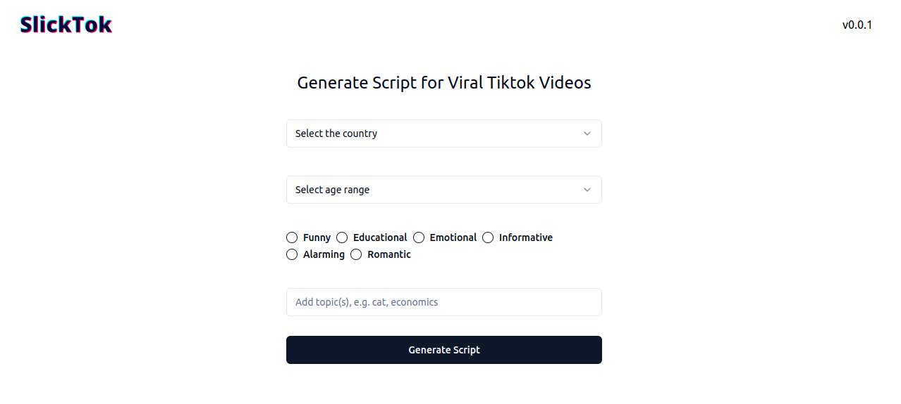
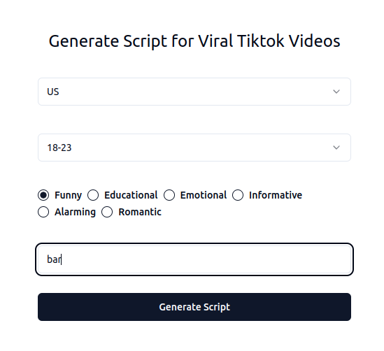

# SlickTok - Generate Script for Viral Tiktok Video

This app uses `Gemini 1.5 Pro` to generate amazing script for Tiktok contents.

You can select:
* Target Country
* Audience Age Range
* Type
* Topic(s)

and it will generate scripts that you can immediately use.

## Output: Bar Edition (20-30 seconds)

**Scene:** A dimly lit bar, upbeat music playing in the background.

**Characters:**

* **Bartender** (20s, cool and collected)
* **Customer** (20s, visibly nervous)

**(Video starts with a close-up shot of a cocktail shaker being shaken vigorously. The camera pans to the Bartender, who smoothly pours a bright pink drink into a martini glass.)**

**Bartender:** (Smirking) First time ordering a drink?

**(Camera cuts to the Customer, who's fidgeting with their phone and avoiding eye contact.)**

**Customer:** (Stuttering) Uh... maybe. What gave it away? The fact that I'm reading the drink menu upside down?

**(The Bartender raises an eyebrow playfully. Camera zooms in on the drink menu, which is indeed upside down.)**

**Bartender:** Could be that. Or maybe it's the fact you're wearing noise-cancelling headphones... in a bar.

**(The Customer sheepishly takes off their headphones. Upbeat music cuts out abruptly. Awkward silence.)**

**Customer:** (Whispering) Is it too late to order a water?

**(The Bartender bursts out laughing. Camera focuses on their reaction for a beat.)**

**Bartender:**  Tell you what, I'll make you something even better. Trust me?

**(The Bartender winks at the camera. Video ends with a shot of the mysterious drink being prepared, overlaid with text: "What do you think's in it? 🤔  #bartenderlife #firsttimedrinker #awkwardmoments")** 

## How to Install

### Pre-requisite
1. Clone this repo
2. Create an API to use Gemini at [Google AI Studio](https://aistudio.google.com/app/apikey)
3. Ensure you have Python, pip, node installed on your machine

### Backend

1. In your root folder, run `cd slicktok-backend`
2. Create a virtual environment and activate it
3. Create an `.env` file and add your `GOOGLE_API_KEY`
3. Install dependencies running `pip install -r requirements.txt`
4. Finally run the server using `uvicorn main:app --host 0.0.0.0 --port 8000`
At http://0.0.0.0/8000 you'll see the server running

### Frontend

1. Go back to root folder running `cd ..`
2. Enter `slicktok-frontend` folder running `cd slicktok-frontend`
3. Run `npm i`
4. Finally, run `npm run dev`
You'll see the app running at http://localhost:5173 

## How to Use
Enter the following info:
* Audience Country: *US, UK, Canada*
* Audience Age Range: *# Could be *13-18, 18-23, 23-28, 28-33, 33-38, 38-43, Above 43*
* Type of video: *funny, educational, emotional, informative, alarming, romantic*
* Video Topic(s): *e.g. cats, couple, work, engineering, politics* 

Click on the Button **Generate Script** and wait...
You'll see the script in a few seconds.